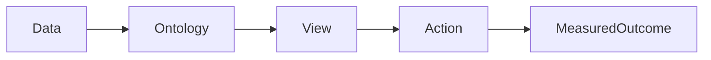

# Day 14｜MVP 是一条可走通的链，不是一个缩小的大系统

> **学习时长：约 20–30 分钟**  
> **今天的成果：** 能界定一个 4–6 周可验证的垂直切片。

## 先用一句话抓住重点

MVP 的边界应明确：用户、对象、数据源、动作、成功指标、暂不做什么。

## 把它放进真实现场

胸痛项目的 MVP 不需要接入所有病种和所有医院。它可只覆盖一个院区、急诊 STEMI、只读数据与一项“创建协同待办”的 Action。价值在于从数据到决策到结果完整闭环。

这不是“把数据画得更漂亮”。它是在**信息不完整、多人协作、必须可追责**的场景里，让下一步工作更明确。以下图是今天要掌握的最小链路：

## 拆开来看：你需要能说清的内容

| 维度 | 今天要问的问题 | 在胸痛协同案例中的落点 |
| --- | --- | --- |
| 业务 | 谁要在什么时点做什么决定？ | 急诊、导管室与协调员如何避免超时 |
| 数据 | 哪些事实可信、何时产生、是否缺失？ | ECG、化验、排程、库存及其时间戳 |
| 模型 | 用什么对象和关系表达它？ | 患者、就诊、检查、风险、待办与资源 |
| 行动 | 系统能建议什么、谁能执行什么？ | 先创建待办/通知，必要时由人确认 |
| 治理 | 出错时如何解释与追溯？ | 数据质量、规则版本、权限和审计 |

## FDE 的现场做法

1. **拿一个真实样本开会。** 不从抽象功能列表开始；找最近一次延迟或差点出错的具体病例/事件。
2. **让业务负责人纠正你的语言。** “高危”“完成”“可用库存”都可能有本院定义，不能凭直觉建字段。
3. **先把未知显出来。** 数据缺失、延迟和身份未核对时，系统应说“不确定”，而不是用默认值伪装确定性。
4. **只自动化低风险的那一步。** 优先做发现、排序、通知、草案；涉及临床决定、采购或对外报送时设置审批与审计。
5. **用结果复盘模型。** 用户是否更早发现例外、处理是否更快、误报来自哪里——这些才决定下周改什么。

## 动手练习（10 分钟）

写出 MVP 的“做/不做”清单，各三项。

建议先在纸上完成。写不出来时，不要急着查工具：通常说明你还没有把“现实中的一个决定”说清楚。

## 参考答案与检查清单

做：急诊 STEMI、HIS+LIS+ECG、绿色通道待办；不做：跨院区、全病种、自动下医嘱。指标：超时病例发现提前量、人工查找时间、用户采纳率。

完成后对照：

- [ ] 能指出至少一个明确的业务角色与触发时点
- [ ] 事实数据与计算/判断结果没有混在一起
- [ ] 图中的每条关系都能用一句自然语言解释
- [ ] 若有动作，已写清谁能执行、失败时如何处理
- [ ] 有一个可量化的试用指标或质量护栏

## 常见误区

以“功能数量”衡量 MVP。MVP 是最小可验证价值，而不是最小页面数。

## 记忆卡

> **本体论学习的顺序：** 先找决策，再找对象；先保留证据，再设计动作；先小范围试用，再扩展自动化。

## 延伸阅读

本课已经给出可完成的最小实践。需要查官方定义或深入工具配置时，再访问 [sources.md](../sources.md) 中按主题整理的资料；不要用链接替代建模与验证。
