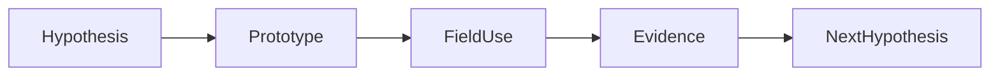
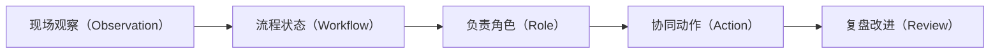

# Day 17｜交付节奏：把不确定性拆成每周可验证的假设

> **学习时长：约 20–30 分钟**  
> **今天的成果：** 理解 FDE 的迭代周：共同定义、搭建、现场试用、复盘，而不是瀑布式“开发完成再验收”。

## 本课术语速览（中英对照）

| 术语 | 中文注释 | 这一课如何理解 |
| --- | --- | --- |
| Ontology（本体论 / 业务语义层） | 将现实业务组织成对象、关系、动作与权限的模型 | 用它连接数据与一线决策，而不是只做报表。 |
| Object（对象） | 可被识别、查询和讨论的业务实体 | 例如 Patient（患者）、Encounter（一次就诊）。 |
| Property（属性） | 描述对象的字段或特征 | 例如采样时间、风险等级、库存数量。 |
| Link（关系链接） | 对象间可解释、可追溯的关联 | 例如患者拥有一次就诊、一次就诊产生检查。 |
| Action（业务动作） | 受角色、审批和审计约束的操作 | 例如创建待办、通知负责人、生成草案。 |
| Patient（患者） | 医疗案例中的服务主体 | 不是一行数据，而是多次就诊和事实的中心。 |
| Encounter（一次就诊 / 就诊事件） | 某一次具体就诊的业务上下文 | 同一 Patient（患者）可以拥有多次 Encounter（一次就诊）。 |
| Risk Assessment（风险评估） | 基于证据和规则形成的判断 | 必须保留来源、时间、规则版本与不确定性。 |

> 读法约定：所有英文术语都以中文含义为先；英文用于与你在产品文档、界面和 FDE 职位描述中见到的表达对齐。完整表见 [GLOSSARY.md](../GLOSSARY.md)。

## 先用一句话抓住重点

站会不应只汇报任务，要回答：本周哪条业务假设被证实或证伪？下周改什么？

## 把它放进真实现场

第一周确认决策和样本；第二周拿到可看的对象；第三周加入一项手工确认 Action；第四周评估结果。每周都要有用户看得懂的产物和可推翻的假设。

这不是“把数据画得更漂亮”。它是在**信息不完整、多人协作、必须可追责**的场景里，让下一步工作更明确。以下图是今天要掌握的最小链路：

## 拆开来看：你需要能说清的内容

| 维度 | 今天要问的问题 | 在胸痛协同案例中的落点 |
| --- | --- | --- |
| 业务 | 谁要在什么时点做什么决定？ | 急诊、导管室与协调员如何避免超时 |
| 数据 | 哪些事实可信、何时产生、是否缺失？ | ECG、化验、排程、库存及其时间戳 |
| 模型 | 用什么对象和关系表达它？ | 患者、就诊、检查、风险、待办与资源 |
| 行动 | 系统能建议什么、谁能执行什么？ | 先创建待办/通知，必要时由人确认 |
| 治理 | 出错时如何解释与追溯？ | 数据质量、规则版本、权限和审计 |

## FDE 的现场做法

1. **拿一个真实样本开会。** 不从抽象功能列表开始；找最近一次延迟或差点出错的具体病例/事件。
2. **让业务负责人纠正你的语言。** “高危”“完成”“可用库存”都可能有本院定义，不能凭直觉建字段。
3. **先把未知显出来。** 数据缺失、延迟和身份未核对时，系统应说“不确定”，而不是用默认值伪装确定性。
4. **只自动化低风险的那一步。** 优先做发现、排序、通知、草案；涉及临床决定、采购或对外报送时设置审批与审计。
5. **用结果复盘模型。** 用户是否更早发现例外、处理是否更快、误报来自哪里——这些才决定下周改什么。

## 动手练习（10 分钟）

为四周 MVP 写出每周验收物。

建议先在纸上完成。写不出来时，不要急着查工具：通常说明你还没有把“现实中的一个决定”说清楚。

## 参考答案与检查清单

W1：决策画布和十个真实样本；W2：Patient/Encounter 视图；W3：待办 Action 与审计；W4：使用数据、访谈和扩展建议。

完成后对照：

- [ ] 能指出至少一个明确的业务角色与触发时点
- [ ] 事实数据与计算/判断结果没有混在一起
- [ ] 图中的每条关系都能用一句自然语言解释
- [ ] 若有动作，已写清谁能执行、失败时如何处理
- [ ] 有一个可量化的试用指标或质量护栏

## 参考答案图解

对照时确认：交付答案必须包含现场约束、责任分工和可回溯的例外处理，而不仅是流程名称。

## 常见误区

把数据接入拖到最后。没有早期样本，所有界面与规则讨论都会漂浮。

## 记忆卡

> **本体论学习的顺序：** 先找决策，再找对象；先保留证据，再设计动作；先小范围试用，再扩展自动化。

## 延伸阅读

本课已经给出可完成的最小实践。需要查官方定义或深入工具配置时，再访问 [sources.md](../sources.md) 中按主题整理的资料；不要用链接替代建模与验证。
